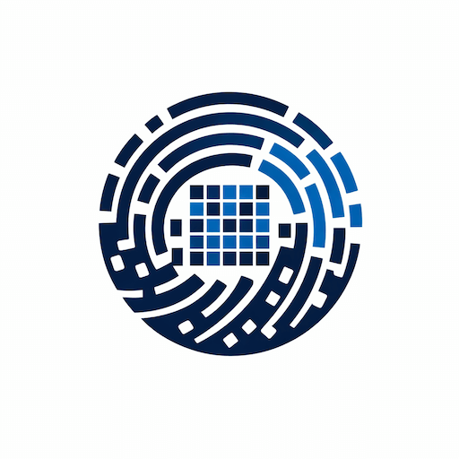

<p align="center">
  
</p>

<p align="center">Go implementation of multiple perceptual hash algorithms for images.</p>

<p align="center">
  <a href="https://github.com/ajdnik/imghash/actions?query=workflow%3Aci"></a>
  <a href="https://coveralls.io/github/ajdnik/imghash?branch=main"></a>
  <a href="https://pkg.go.dev/github.com/ajdnik/imghash/v2"></a>
  <a href="https://goreportcard.com/report/github.com/ajdnik/imghash/v2"></a>
  <a href="https://github.com/ajdnik/imghash/blob/main/LICENSE"></a>
</p>

## Documentation

Detailed documentation has moved to the Wiki:

- [Wiki Home](https://github.com/ajdnik/imghash/wiki)
- [Algorithms](https://github.com/ajdnik/imghash/wiki/Algorithms)
- [Similarity Metrics](https://github.com/ajdnik/imghash/wiki/Similarity-Metrics)
- [Convenience Functions](https://github.com/ajdnik/imghash/wiki/Convenience-Functions)
- [Interpolation Methods](https://github.com/ajdnik/imghash/wiki/Interpolation-Methods)
- [Migration Guide](https://github.com/ajdnik/imghash/wiki/Migration-Guide)

## Installing

```sh
go get -u github.com/ajdnik/imghash/v2
```

```go
import "github.com/ajdnik/imghash/v2"
```

Most consumers only need the top-level `imghash` package. Core types (`Hash`, `Binary`, `UInt8`, `Float64`, `Distance`) are re-exported there.

## Quick Start

If you're unsure which hash to pick, start with PDQ.

```go
package main

import (
  "fmt"

  "github.com/ajdnik/imghash/v2"
)

func main() {
  pdq, err := imghash.NewPDQ()
  if err != nil {
    panic(err)
  }

  h1, err := imghash.HashFile(pdq, "image1.png")
  if err != nil {
    panic(err)
  }

  h2, err := imghash.HashFile(pdq, "image2.png")
  if err != nil {
    panic(err)
  }

  dist, err := pdq.Compare(h1, h2)
  if err != nil {
    panic(err)
  }

  fmt.Printf("Distance: %v\n", dist)
}
```

## Algorithms at a Glance

| Algorithm | Hash type | Default metric |
|-----------|-----------|----------------|
| Average | `Binary` | Hamming |
| Difference | `Binary` | Hamming |
| Median | `Binary` | Hamming |
| PHash | `Binary` | Weighted Hamming |
| WHash | `Binary` | Hamming |
| MarrHildreth | `Binary` | Hamming |
| BlockMean | `Binary` | Hamming |
| PDQ | `Binary` | Hamming |
| RASH | `Binary` | Hamming |
| ColorMoment | `Float64` | L2 (Euclidean) |
| Zernike | `Float64` | L2 (Euclidean) |
| GIST | `Float64` | Cosine |
| BoVW (Histogram) | `Float64` | Cosine |
| BoVW (MinHash) | `Float64` | Jaccard |
| BoVW (SimHash) | `Binary` | Jaccard |
| CLD | `UInt8` | L2 (Euclidean) |
| EHD | `UInt8` | L1 (Manhattan) |
| LBP | `UInt8` | Chi-Square |
| HOGHash | `UInt8` | Cosine |
| RadialVariance | `UInt8` | L1 (Manhattan) |

See [Algorithms](https://github.com/ajdnik/imghash/wiki/Algorithms) for options, defaults, references, and examples.

## Community

- [Code of Conduct](CODE_OF_CONDUCT.md)
- [Contributing Guide](CONTRIBUTING.md)
- [Security Policy](SECURITY.md)
- [Migration Guide](https://github.com/ajdnik/imghash/wiki/Migration-Guide)

## License

Imghash is released under the MIT license. See [LICENSE](LICENSE).
